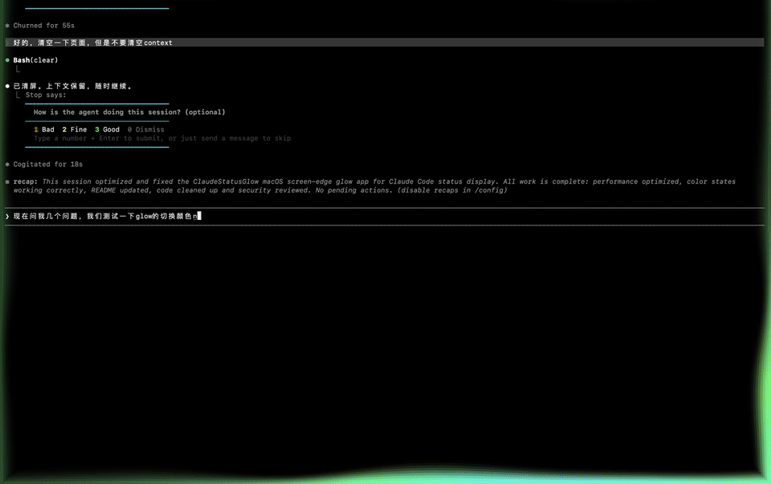
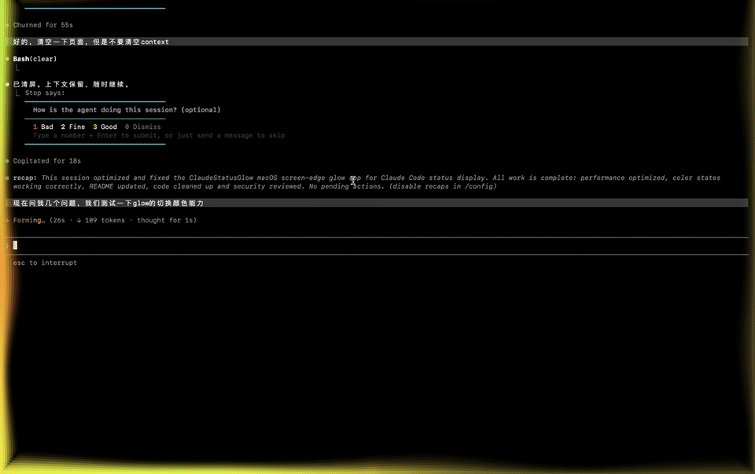
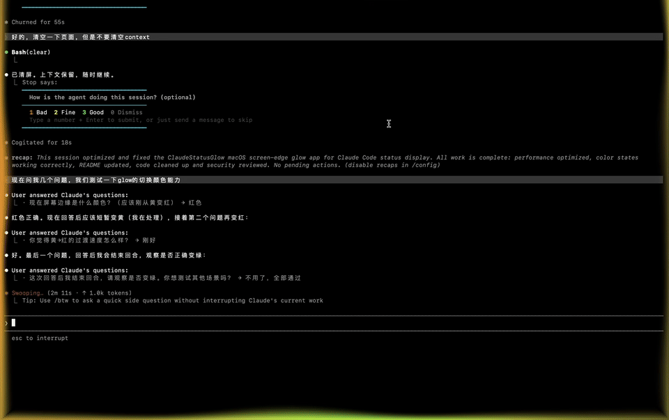

# Claude Code Status Glow for macOS

<p align="center">
  <b>你的CC红绿灯</b><br/>
  <i>Your screen edge now show Claude status like traffic light.</i>
</p>

<p align="center">
  
  
  
  
</p>

<p align="center">
  <a href="#-中文简介">中文</a> •
  <a href="#-english-overview">English</a> •
  <a href="#-demo-gif">Demo GIF</a> •
  <a href="#-star-history">Star History</a>
</p>

---

## 中文简介

`Claude Code Status Glow` 会在你的整个屏幕边缘显示动态边缘光，实时反映 Claude Code 当前状态，类似Siri的唤醒动画
就像是红绿灯一样显眼
不用来回切终端，不用盯日志，一眼就知道 AI 在忙、在等你，还是在摸鱼（不是，是在 idle）。

### 状态颜色

- `黄色`：Claude 正在执行（running）
- `红色`：需要你确认/回答（needs_confirmation）
- `绿色`：空闲等待（idle）

### 为什么你会喜欢它

- **低打扰，高感知**：边缘提示，不挡住内容
- **开箱即用**：一键脚本安装 hooks
- **可调节**：菜单栏支持亮度、波浪宽度、空闲显示开关（实时生效）
- **轻量**：Swift 原生实现，零第三方依赖

---

## English Overview

`Claude Code Status Glow` adds an animated glow around the entire screen edge and reflects Claude Code state in real time.  
No more terminal peeking every 10 seconds. Your screen tells you what Claude is doing.

### Color Map

- `Yellow`: Claude is working (`running`)
- `Red`: Claude needs your confirmation (`needs_confirmation`)
- `Green`: Claude is idle (`idle`)

### Why this is useful

- **Signal without noise**: visual cue at the edge, not in your face
- **Quick setup**: install hooks with one script
- **Customizable**: brightness, wave width, and show-when-idle toggle in menu bar (applies instantly)
- **Lightweight**: native Swift app, zero external dependencies

### Interactive Controls

- `Brightness`: tune glow intensity
- `Wave Width`: tune glow thickness
- `Show When Idle`: decide whether green idle glow is visible

---

## Demo GIF

### 运行中｜黄色｜Running (Yellow)


### 需要确认｜红色｜Needs Confirmation (Red)


### 空闲状态｜绿色｜Idle (Green)


---

## Quick Start (60s)

### 1) Clone and build

```bash
git clone https://github.com/vickrick2022/claudecode-status-glow-light.git ~/claudecode-status-glow-mac
cd ~/claudecode-status-glow-mac
swift build -c release
```

### 2) Start app and install hooks

```bash
pkill -f ClaudeStatusGlow 2>/dev/null
cd ~/claudecode-status-glow-mac
.build/release/ClaudeStatusGlow & disown
./install.sh
```

### 3) (Optional) Add `/glow` command for Claude Code

```bash
mkdir -p ~/.claude/commands
cat > ~/.claude/commands/glow.md << 'SKILL'
启动或管理屏幕边缘状态光圈（Claude Status Glow）。

## 用法
- /glow 或 /glow start：启动光圈并安装 hooks
- /glow stop：停止光圈并卸载 hooks
- /glow status：查看运行状态

## 行为
### start
执行：
- `pkill -f ClaudeStatusGlow 2>/dev/null`
- `cd ~/claudecode-status-glow-mac`
- `swift build -c release`
- `.build/release/ClaudeStatusGlow & disown`
- `./install.sh`

### stop
执行：
- `pkill -f ClaudeStatusGlow 2>/dev/null`
- `~/claudecode-status-glow-mac/uninstall.sh`

### status
执行：
- `ps aux | grep -v grep | grep ClaudeStatusGlow && echo "光圈运行中" || echo "光圈未运行"`
- `cat ~/.claudecode/status.json 2>/dev/null || echo "无状态文件"`
SKILL
```

### 4) Use in Claude Code

```text
/glow
/glow status
/glow stop
```

---

## Requirements

- macOS 13+
- Swift 5.9+ (Xcode Command Line Tools)
- Claude Code CLI

---

## How It Works

1. Claude Code hooks write status to `~/.claudecode/status.json`
2. The app polls the status file and updates edge glow color
3. `needs_confirmation` is debounced by 400ms to avoid red flicker on auto-approved tools

### Hook Mapping

| Event | State | Color |
|------|------|------|
| `UserPromptSubmit` | `running` | Yellow |
| `PreToolUse` | `needs_confirmation` | Red |
| `PostToolUse` | `running` | Yellow |
| `Stop` | `idle` | Green |

---

## Menu Bar Controls

打开菜单栏中的 **Claude光圈**，可实时调整：

- 亮度（Brightness）
- 波浪宽度（Wave Width）
- 空闲时是否显示（Show When Idle）

---

## Manual Testing

```bash
./scripts/set-status.sh running            # yellow
./scripts/set-status.sh needs_confirmation # red
./scripts/set-status.sh idle               # green
```

---

## Troubleshooting

- 看不到边缘光？先确认进程是否在运行：
  ```bash
  ps aux | grep -v grep | grep ClaudeStatusGlow
  ```
- 颜色不变化？检查状态文件：
  ```bash
  cat ~/.claudecode/status.json
  ```
- 还不行？重启应用 + 重新安装 hooks（经典玄学三连）。

---

## Uninstall

```bash
~/claudecode-status-glow-mac/uninstall.sh
rm ~/.claude/commands/glow.md
rm -rf ~/claudecode-status-glow-mac
```

---

## Roadmap

---

## Star History

[](https://www.star-history.com/#vickrick2022/claudecode-status-glow-light&Date)

---

## Contributing

PRs, issues, and ideas are welcome.  
If this project helped you, consider giving it a star - it powers the RGB photons.
